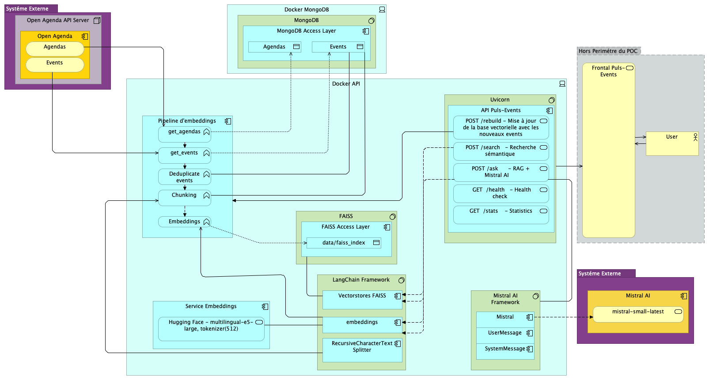

# Rapport technique – Assistant intelligent de recommandation d’événements culturels

## 1. Objectifs du projet
### Contexte : 

- Puls-Events est une entreprise technologique innovante spécialisée dans le développement d'une plateforme de recommandations culturelles personnalisées.

- Pour améliorer l'expérience utilisateur et répondre à l'évolution des attentes numériques, Puls-Events souhaite intégrer un assistant intelligent capable de gérer les requêtes des utilisateurs en temps réel.

### Problématique :

- Un système RAG (Retrieval-Augmented Generation) répond aux besoins métier de Puls-Events en résolvant la problématique centrale de l'accès précis et fiable à l'information événementielle par un chatbot.

- Le RAG surmonte les limites des modèles de langage classiques (LLMs) pour fournir une solution à la fois performante et économiquement viable.

### Objectif du POC :

- L'objectif du POC pour Puls-Events est de démontrer de manière concrète et mesurable que la technologie RAG (Retrieval-Augmented Generation), en utilisant LangChain, Mistral et FAISS, est la solution optimale pour alimenter le futur chatbot d'événements culturels.

- Cet objectif se décline en trois axes principaux : 
    - la faisabilité technique, 
    - la valeur métier 
    - et la performance.

1. Démontrer la Faisabilité Technique 🛠️

Il s'agit de prouver que l'intégration des composants clés est fonctionnelle et stable, menant à une solution prête pour l'industrialisation.

Intégration du Pipeline Complet : Prouver la capacité à orchestrer le flux de données de bout en bout : de l'extraction des données d'événements récents via l'API Open Agenda, à leur transformation en embeddings, leur stockage dans l'index FAISS, et leur utilisation par le LLM Mistral via LangChain pour la génération de la réponse.

Portabilité et Déploiement : Valider la capacité à livrer un système standardisé et reproductible grâce à la conteneurisation Docker et à l'exposition via une API REST (FastAPI).

2. Démontrer la Valeur Métier (Pertinence) ✨

L'objectif est de s'assurer que le système répond directement aux besoins de l'utilisateur final et de l'entreprise Puls-Events.

Véracité des Réponses : Démontrer que le RAG élimine les "hallucinations" en basant systématiquement les réponses sur le contexte factuel et à jour des événements (dates, lieux, artistes, genres) extrait d'Open Agenda. C'est la validation de la fiabilité de l'information.

Expérience Utilisateur Améliorée : Prouver que le chatbot peut gérer et répondre avec fluidité à une grande variété de questions en langage naturel, y compris les requêtes sémantiques complexes (e.g., "Je cherche quelque chose de familial le week-end prochain") basées sur le jeu de test annoté.

Efficacité Opérationnelle : Montrer que ce système est plus rentable et plus rapide à actualiser qu'une approche de fine-tuning du LLM, car seule la base vectorielle a besoin d'être mise à jour avec les nouveaux événements.

3. Démontrer la Performance (Qualité et Rapidité) ⚡

Il faut quantifier l'efficacité du système à la fois sur la recherche et la génération.

Performance du Retrieval : Mesurer l'efficacité de FAISS à remonter les fragments de texte pertinents. Le Hit Rate (pourcentage de fois où le bon fragment est dans les top-k résultats) est la métrique clé pour valider que la bonne information est trouvée.

Qualité de la Génération : Mesurer la fidélité (faithfulness) et la pertinence de la réponse générée par Mistral par rapport au contexte fourni. La réponse doit être bien rédigée, concise et répondre directement à la question de l'utilisateur.

Latence (Temps de Réponse) : S'assurer que le système complet (API + RAG) offre un temps de réponse acceptable pour une expérience utilisateur fluide (cible typique : quelques secondes ou moins).


- Périmètre : Zone géographique ciblée, période d’événements, données utilisées.

## Architecture du système
### Schéma global :



### Données entrantes (API Open Agenda)

**Source de données :** API Open Agenda v2 (https://api.openagenda.com/v2)

**Endpoints utilisés :**
- `/agendas` : Récupération des agendas culturels officiels par région
- `/agendas/{uid}/events` : Récupération des événements pour chaque agenda

**Paramètres de collecte :**
- **Région ciblée** : Occitanie (configurable via `OA_REGION` dans .env)
- **Pagination** : Curseur `after[]` avec taille de page de 100 événements (`OA_PAGE_SIZE=100`)
- **Filtrage temporel** :
  - Agendas : `updatedAt >= date` (dernière exécution ou 1 an par défaut)
  - Événements : `createdAt >= date` OU `updatedAt >= date` (mode UPDATE)

**Données extraites par événement :**
- **Métadonnées** : uid, title, description, slug
- **Temporalité** : timings (date_debut, date_fin), createdAt, updatedAt
- **Localisation** : location (coordinates, name, address, city, region)
- **Classification** : keywords, categories
- **Relations** : agendaUid (lien avec l'agenda parent)

**Stockage intermédiaire :**
- **Base MongoDB** : Collections `agendas` et `events`
- **Stratégie upsert** : Évite les doublons grâce à des clés uniques (uid pour agendas, (uid, agendaUid) pour events)
- **Dédoublonnement** : Script de nettoyage pour éliminer les événements dupliqués par uid

**Mise à jour incrémentale :**
- Pipeline de mise à jour qui sauvegarde les collections existantes (`_update_YYYYMMDD_HHMMSS`)
- Récupération sélective des agendas/événements modifiés depuis la dernière exécution
- Tracking des exécutions dans la collection `last_update` avec métadonnées complètes

### Prétraitement / embeddings / base vectorielle

**Pipeline de traitement (src/chunks/chunks_document.py) :**

1. **Formatage des documents**
   - Conversion des événements MongoDB en texte structuré
   - Format : `Titre: {title}\nDates: {date_debut} - {date_fin}\nDescription: {description}\nLieu: {locationName}\nMots-clés: {keywords}`

2. **Extraction des métadonnées**
   - Champs conservés : event_id, title, city, date_debut, date_fin, location (coordonnées GPS), region, keywords

3. **Chunking (LangChain RecursiveCharacterTextSplitter)**
   - **Taille des chunks** : 500 caractères (configurable via `CHUNK_SIZE`)
   - **Overlap** : 100 caractères (configurable via `CHUNK_OVERLAP`)
   - **Raison** : Équilibre entre contexte suffisant et précision de la recherche
   - **Sortie** : Objets LangChain `Document` avec contenu + métadonnées

**Génération des embeddings (src/embeddings/embeddings.py) :**

- **Modèle** : `intfloat/multilingual-e5-large` (HuggingFace Transformers)
- **Dimensionnalité** : 1024 dimensions
- **Multilingue** : Support de 100+ langues incluant le français
- **Local** : Pas d'API externe, inférence locale (pas de clé API requise)
- **Stratégie** :
  - Average pooling avec masque d'attention
  - Préfixes : "passage:" pour documents, "query:" pour requêtes
  - Normalisation L2 pour similarité cosinus optimale
- **Performance** :
  - Détection automatique du device (CUDA, MPS, CPU)
  - Batch processing (taille de batch configurable, défaut : 32)
  - ~50-100 chunks/seconde sur Apple Silicon (MPS)

**Construction de la base vectorielle (src/vectors/vectors.py) :**

- **Bibliothèque** : FAISS (Facebook AI Similarity Search)
- **Type d'index** : FAISS avec LangChain wrapper
- **Persistance** :
  - Format : Fichiers binaires FAISS + pickle pour métadonnées
  - Chemin : `data/faiss_index/` (configurable via `FAISS_INDEX_PATH`)
  - Sauvegarde : `index.faiss` + `index.pkl`
- **Métadonnées stockées** : Toutes les métadonnées extraites sont conservées avec chaque vecteur
- **Opérations supportées** :
  - Création d'index
  - Chargement d'index existant
  - Ajout de documents
  - Recherche par similarité (similarity_search_with_score)
  - Suppression d'index
  - Statistiques (nombre de vecteurs, dimension)

**Statistiques actuelles :**
- ~28,962 vecteurs indexés (exemple du développement)
- Dimension : 1024
- Couvre tous les événements culturels d'Occitanie récents

### Intégration LLM avec LangChain

**Modèle LLM sélectionné :**
- **Fournisseur** : Mistral AI
- **Modèle** : `mistral-small-latest` (configurable via `MISTRAL_MODEL`)
- **Raisons du choix** :
  - Excellence sur le français
  - Rapport qualité/coût optimal
  - Latence faible
  - Compatibilité native avec LangChain
  - API simple et fiable

**Architecture RAG (Retrieval-Augmented Generation) :**

1. **Recherche sémantique (Retrieval)**
   - Query embedding avec le même modèle E5
   - Recherche FAISS des top-k documents similaires (k=5 par défaut)
   - Récupération du contenu + métadonnées + scores de similarité

2. **Enrichissement du contexte**
   - Formatage des documents récupérés en contexte structuré
   - Inclusion des métadonnées pertinentes (titre, lieu, dates)
   - Limitation du contexte pour éviter le dépassement de tokens

3. **Génération de réponse**
   - **Prompt système** : Chargé depuis `src/chat/ps.md` (Puls-Events persona)
   - **Directives** :
     - Réponses basées uniquement sur le contexte fourni
     - Champ d'application : Occitanie et événements culturels
     - Ton : Enthousiaste, accueillant, clair et concis
     - Gestion de l'ambiguïté et des questions hors-sujet
   - **Prompt utilisateur enrichi** : Question + contexte RAG
   - **Appel Mistral AI** : Via `mistral_client.chat.complete()`
   - **Retour** : Réponse + contexte utilisé + statistiques tokens

**Implémentation LangChain :**
- **Custom Embeddings** : Classe `E5Embeddings(Embeddings)` compatible LangChain
- **Vector Store** : Wrapper FAISS de LangChain
- **Retrieval** : `vector_store.similarity_search_with_score(query, k=k)`
- **Messages** : `SystemMessage` + `UserMessage` pour Mistral AI

**Gestion de la qualité :**
- Système de scoring de similarité pour filtrer les résultats peu pertinents
- Limitation du nombre de documents contextuels (évite la surcharge)
- Tracking des tokens utilisés (prompt + completion + total)
- Fallback gracieux si pas de contexte pertinent trouvé

### Exposition via API

**Framework** : FastAPI 0.120.1+

**Architecture de l'API (src/api/main.py) :**

**Endpoints principaux :**

1. **GET /** - Point d'entrée
   - Liste tous les endpoints disponibles
   - Version de l'API

2. **GET /health** - Health check
   - Statut : ok | degraded
   - État des composants : vector_store, embeddings_model, mistral_client
   - Permet le monitoring

3. **GET /stats** - Statistiques du vector store
   - Nombre de vecteurs indexés
   - Dimension des vecteurs
   - Chemin de l'index

4. **POST /search** - Recherche sémantique pure
   - **Entrée** : `{"query": "...", "k": 5}`
   - **Sortie** : Résultats avec scores, titres, contenus, métadonnées
   - **Validation** : query non vide, k entre 1 et 100

5. **POST /ask** - Question-réponse avec RAG + Mistral AI
   - **Entrée** : `{"question": "...", "k": 5, "system_prompt": "..." (optionnel)}`
   - **Processus** :
     1. Recherche sémantique (top-k documents)
     2. Enrichissement du prompt avec contexte
     3. Appel Mistral AI
     4. Retour de la réponse
   - **Sortie** : `{"question": "...", "answer": "...", "context_used": [...], "tokens_used": {...}}`

6. **POST /rebuild** - Reconstruction incrémentale de l'index FAISS
   - Lance `update_pipeline.py` en arrière-plan
   - Vérification préalable : nouveaux événements présents ?
   - **Workflow** :
     1. Récupère la date de dernière exécution
     2. Compte les nouveaux événements MongoDB
     3. Si aucun : annule avec statut "warning"
     4. Sinon : lance le pipeline complet
     5. Recharge automatiquement l'index en mémoire
   - **Statuts** : started | running | success | success_with_warning | warning | error
   - Protection anti-concurrence (un seul rebuild à la fois)

7. **GET /rebuild/status** - Suivi du rebuild
   - Statut actuel et détails
   - Date de dernière mise à jour
   - Timestamps de démarrage

**Fonctionnalités techniques :**

- **CORS** : Configuré pour autoriser les requêtes cross-origin
- **Startup event** : Chargement automatique du vector store + embeddings + Mistral client au démarrage
- **Background tasks** : Exécution asynchrone du rebuild sans bloquer l'API
- **Rechargement automatique** : Nouvel index FAISS chargé en mémoire après rebuild réussi
- **Auto-documentation** : Swagger UI accessible à `/docs`
- **Gestion d'erreurs** : HTTPException avec codes appropriés (422, 503, 500)
- **Logging** : Logs détaillés de toutes les opérations
- **Hot-reload** : Activé en mode développement

**Format des réponses :**
- JSON structuré avec modèles Pydantic (validation automatique)
- Codes HTTP standards
- Messages d'erreur explicites

**Déploiement :**
- **Développement** : `uvicorn` avec hot-reload (`make run-api`)
- **Production** : Docker + docker-compose
- **Port** : 8000 (configurable)
- **Host** : 0.0.0.0

**Tests unitaires :**
- 10 tests passants couvrant tous les endpoints principaux
- Mocking complet des dépendances (MongoDB, FAISS, Mistral)
- Pytest avec support async
- Commandes : `make test` | `make test-cov`

### Technologies utilisées :

**Backend et orchestration :**
- **Python 3.13+** : Langage principal
- **FastAPI 0.120.1+** : Framework web moderne et rapide
- **Uvicorn** : Serveur ASGI avec hot-reload
- **LangChain 1.0.2+** : Framework d'orchestration LLM
  - `langchain-community` : Intégrations communautaires
  - `langchain-mistralai` : Connecteur Mistral AI
  - `langchain-text-splitters` : Chunking de documents
- **python-dotenv** : Gestion des variables d'environnement

**LLM et embeddings :**
- **Mistral AI API (mistralai 1.9.11+)** : Génération de réponses
  - Modèle : `mistral-small-latest`
  - SystemMessage/UserMessage pour le chat
- **HuggingFace Transformers 4.57.1+** : Modèles NLP locaux
  - `intfloat/multilingual-e5-large` : Embeddings multilingues (1024 dim)
- **PyTorch 2.9.0+** : Backend pour les transformers
  - Support CUDA/MPS/CPU

**Base de données et vectorielle :**
- **MongoDB (PyMongo 4.15.3+ / Motor 3.7.1+)** : Stockage des événements
  - Collections : `agendas`, `events`, `last_update`
  - Opérations bulk avec upsert
- **FAISS (faiss-cpu 1.12.0+)** : Recherche vectorielle
  - Index persistant sur disque
  - Recherche par similarité cosinus

**Scraping et API :**
- **Requests 2.32.5+** : Appels HTTP vers Open Agenda API
- **BeautifulSoup4 (bs4 0.0.2+)** : Parsing HTML si nécessaire

**Validation et modèles de données :**
- **Pydantic 2.12.3+** : Validation des données API
  - Modèles pour requêtes/réponses FastAPI

**Outils de développement :**
- **pytest 8.3.0+** : Tests unitaires
  - `pytest-asyncio 0.24.0+` : Support async
  - `pytest-cov 6.0.0+` : Couverture de code
  - `httpx 0.28.0+` : Client HTTP async pour tests
- **flake8 7.3.0+** : Linter Python
- **uv** : Gestionnaire de dépendances rapide
- **Make** : Orchestration des commandes

**Conteneurisation et déploiement :**
- **Docker** : Conteneurisation de l'application
- **docker-compose** : Orchestration multi-conteneurs
  - Service MongoDB
  - Service API FastAPI

**Utilitaires :**
- **NumPy 2.3.4+** : Calculs matriciels
- **pathlib** : Manipulation de chemins
- **asyncio** : Programmation asynchrone
- **logging** : Journalisation applicative

**Configuration système :**
- **macOS fix** : `KMP_DUPLICATE_LIB_OK=TRUE` pour OpenMP
- **Environnement** : Fichier `.env` pour la configuration
- **Makefile** : Commandes standardisées (`make install`, `make run-all`, etc.)


### Préparation et vectorisation des données
#### Source de données : API Open Agenda (paramètres utilisés, filtres appliqués)
- **Endpoints** : `/agendas` pour lister les agendas officiels, puis `/agendas/{uid}/events` pour récupérer les événements.
- **Paramètres clés** : `official: 1` pour ne retenir que les sources fiables, `search: Occitanie` pour le ciblage géographique.
- **Filtres temporels** : Le pipeline de mise à jour incrémentale (`update`) filtre les agendas et événements sur la base de la date de la dernière exécution (`createdAt >= date` ou `updatedAt >= date`), assurant une collecte efficace des nouveautés.

#### Nettoyage : Exemples d’anomalies corrigées, méthodes utilisées
- **Anomalie corrigée** : Présence d'événements en double, identifiés par un `uid` identique mais des `_id` MongoDB différents.
- **Méthode utilisée** : Le script `src/corpus/deduplicate_events.py` est exécuté après la collecte. Pour chaque `uid` dupliqué, il conserve uniquement l'événement le plus récent en se basant sur le champ `updatedAt` et supprime les autres.

#### Chunking : Raison du découpage, taille choisie
- **Outil** : `RecursiveCharacterTextSplitter` de LangChain.
- **Taille choisie** : **500 caractères** (`CHUNK_SIZE`) avec un chevauchement de **100 caractères** (`CHUNK_OVERLAP`).
- **Raison du découpage** : Cette configuration offre un équilibre optimal. Les chunks sont assez petits pour que la recherche sémantique soit très précise, mais assez grands pour conserver un contexte sémantique suffisant. Le chevauchement empêche de couper des phrases ou des idées importantes entre deux chunks.

#### Embedding :
##### Modèle utilisé (ex. : Mistral embedding API)
- **Modèle** : `intfloat/multilingual-e5-large`, un modèle de pointe exécuté localement via la bibliothèque HuggingFace Transformers.
- **Justification** : Ce choix a été fait pour ses excellentes performances sur les tâches de *retrieval* en français, sa capacité à s'exécuter localement (pas de dépendance à une API externe, pas de coût par token) et sa dimensionnalité élevée.

##### Dimensionnalité, logique de batch, format des vecteurs
- **Dimensionnalité** : **1024 dimensions**, ce qui permet une représentation sémantique très riche.
- **Logique de batch** : La vectorisation est effectuée par lots (taille de 32 par défaut) pour optimiser l'utilisation des ressources matérielles (CPU/GPU/MPS) et accélérer le traitement.
- **Format des vecteurs** : Les vecteurs sont des flottants normalisés (L2), ce qui est idéal pour les calculs de similarité cosinus. Le modèle utilise des préfixes spécifiques (`"passage:"` pour les documents, `"query:"` pour les requêtes) afin d'améliorer la pertinence de la recherche.

### Choix du modèle NLP
##### Modèle sélectionné :
- **Fournisseur** : Mistral AI
- **Modèle** : `mistral-small-latest` (configurable via la variable d'environnement `MISTRAL_MODEL`)

##### Pourquoi ce modèle ? (Critères : coût, qualité, compatibilité LangChain…)
- **Qualité sur le français** : Les modèles Mistral sont reconnus pour leur excellente performance et leur compréhension nuancée de la langue française.
- **Rapport performance/coût** : `mistral-small-latest` offre un excellent équilibre entre une latence faible, une haute qualité de génération et un coût par token maîtrisé, ce qui est idéal pour un POC.
- **Compatibilité LangChain** : Le modèle est nativement supporté via le package `langchain-mistralai`, permettant une intégration simple et rapide dans l'architecture RAG.

##### Prompting (si utilisé) : Prompt de base / structure
- **Prompt Système** : Un prompt système détaillé, stocké dans `src/chat/ps.md`, définit la personnalité du chatbot ("Puls-Events"). Il lui donne des instructions strictes : répondre uniquement sur la base du contexte fourni, se limiter à la région Occitanie, et adopter un ton convivial et précis.
- **Structure du prompt enrichi** : La requête finale envoyée à Mistral est structurée en deux parties :
    1.  `SystemMessage` : Contient les instructions de `ps.md`.
    2.  `UserMessage` : Contient un prompt enrichi qui combine :
        - Le contexte récupéré depuis la base vectorielle (les événements pertinents).
        - La question originale de l'utilisateur.
        - Une instruction finale demandant de baser la réponse sur le contexte.

##### Limites du modèle :
- **Dépendance à une API externe** : Contrairement au modèle d'embedding, l'utilisation de Mistral AI nécessite une connexion internet et une clé API valide, ce qui engendre un coût par utilisation (basé sur les tokens).
- **Fenêtre de contexte** : Le modèle a une taille de contexte limitée. Le nombre de documents injectés dans le prompt (`RAG_TOP_K`) doit être contrôlé pour ne pas dépasser cette limite et pour maîtriser les coûts.

### Construction de la base vectorielle
##### Faiss utilisé :
- **Bibliothèque** : **FAISS** (Facebook AI Similarity Search), une bibliothèque hautement optimisée pour la recherche de similarité sur de grands volumes de vecteurs.
- **Intégration** : Le projet utilise le wrapper `FAISS` fourni par `langchain-community`, ce qui simplifie la création, la sauvegarde, le chargement et l'interrogation de l'index.

##### Stratégie de persistance :
- **Format de sauvegarde** : L'index est sauvegardé sur le disque dans le répertoire `data/faiss_index/` (configurable via `FAISS_INDEX_PATH`). Il se compose de deux fichiers :
    - `index.faiss` : Contient les vecteurs numériques dans un format binaire optimisé par FAISS.
    - `index.pkl` : Un fichier pickle contenant le mapping entre les index des vecteurs et les métadonnées des documents (`docstore`).

##### Métadonnées associées :
- Chaque chunk vectorisé conserve un ensemble riche de métadonnées extraites de l'événement original. Ces métadonnées sont cruciales pour filtrer, afficher et contextualiser les résultats de recherche.
- **Champs conservés** : `event_id`, `title`, `city`, `date_debut`, `date_fin`, `location` (coordonnées GPS), `region`, `keywords`.

### API et endpoints exposés
##### Framework utilisé : FastAPI
- L'API est développée avec **FastAPI**, un framework Python moderne et performant, et servie par **Uvicorn**, un serveur ASGI. Ce choix garantit des temps de réponse rapides et une scalabilité aisée.

##### Endpoints clés :
- **`POST /ask`** : Le cœur du système RAG. Prend une question en JSON, effectue une recherche sémantique pour trouver des contextes pertinents, enrichit un prompt et interroge le LLM (Mistral) pour générer une réponse factuelle.
- **`POST /search`** : Endpoint de recherche sémantique pure. Il retourne les `k` documents les plus pertinents de la base vectorielle avec leurs scores de similarité, sans passer par le LLM.
- **`POST /rebuild`** : Déclenche le pipeline de mise à jour incrémentale de l'index en arrière-plan. Il est non-bloquant et vérifie au préalable si de nouveaux événements justifient une mise à jour.
- **`GET /rebuild/status`** : Permet de suivre l'état d'avancement du pipeline de reconstruction (ex: `running`, `success`, `error`).
- **`GET /health`** et **`GET /stats`** : Endpoints de monitoring pour vérifier l'état de santé de l'API et les statistiques de l'index (nombre de vecteurs, etc.).

##### Format des requêtes/réponses
- Les formats sont validés par des modèles **Pydantic** pour assurer la robustesse.
- **Requête `/ask`** : `{"question": "...", "k": 5}`
- **Réponse `/ask`** :
  ```json
  {
    "question": "...",
    "answer": "...",
    "context_used": [ { "score": 0.8, "title": "...", ... } ],
    "tokens_used": { "prompt_tokens": ..., "total_tokens": ... }
  }
  ```

##### Exemple d’appel API : avec curl
- **Pour poser une question au RAG :**
  ```bash
  curl -X POST http://localhost:8000/ask \
    -H "Content-Type: application/json" \
    -d '{"question": "Quels sont les festivals de jazz en Occitanie ?", "k": 5}'
  ```
- **Pour lancer une reconstruction de l'index :**
  ```bash
  curl -X POST http://localhost:8000/rebuild
  ```

##### Tests effectués et documentés
- Le projet inclut une suite de tests unitaires complète utilisant **Pytest** et **HTTPX**.
- Les dépendances externes (FAISS, Mistral) sont **mockées** pour isoler les tests de l'API.
- Des tests d'évaluation de la qualité du RAG sont également implémentés avec **RAGAS** (`make test-ragas`) pour mesurer la pertinence et la fidélité des réponses.

##### Gestion des erreurs / limitations
- L'API utilise les `HTTPException` de FastAPI pour retourner des codes d'erreur standards (422 pour une requête invalide, 503 si un service est indisponible, 500 pour une erreur interne).
- L'endpoint `/rebuild` est protégé contre les exécutions concurrentes.

## 7. Évaluation du système

### Jeu de test annoté

#### Nombre d'exemples
Le système est évalué sur un **jeu de test de 10 questions** annotées manuellement, couvrant différentes catégories d'usage :
- **3 questions sur les marchés de Noël** (recherche générale, informations détaillées, horaires)
- **3 questions sur le Toulouse Game Show** (TGS) (dates, tarifs, programme)
- **3 questions sur la Fête du Kiwi** (dates, activités spécifiques)
- **1 question hors-sujet** (test de gestion des limites)

Le jeu de test est stocké dans `tests/ragas_data/ragas_test_questions.json` et suit la structure RAGAS recommandée.

#### Méthode d'annotation
L'annotation suit un processus en **deux phases** :

**Phase 1 - Collecte des données (`make collect-ragas`)** :
- **Exécution dynamique** : Chaque question est posée au système RAG via l'endpoint `/ask`
- **Capture des réponses** :
  - `answer` : Réponse générée par Mistral AI basée sur le contexte récupéré
  - `contexts` : Top-5 chunks d'événements récupérés par FAISS (avec scores de similarité)
- **Génération de ground_truth** (conditionnelle) :
  - **Si ground_truth existe déjà** dans le fichier source : la valeur manuelle est **préservée**
  - **Si ground_truth est vide ou null** : génération automatique basée sur les métadonnées récupérées
    - Pour les questions normales : Liste automatique des titres d'événements pertinents trouvés
    - Pour les questions hors-sujet : Texte explicatif sur les limites du système
  - **Avantage** : Permet une annotation hybride (automatique + corrections manuelles)
- **Sauvegarde** : Données collectées dans `ragas_test_questions_collected.json`

**Phase 2 - Évaluation RAGAS (`make test-ragas`)** :
- **Validation des données** : Vérification de la complétude (question, answer, contexts, ground_truth)
- **Calcul des métriques** : Mistral AI agit comme juge indépendant pour évaluer la qualité
- **Génération du rapport** : Console + rapport HTML visuel (`rapport/ragas/ragas_report.html`)

Cette approche garantit une **séparation stricte** entre la collecte (test du système) et l'évaluation (mesure de la qualité).

### Métriques d'évaluation

Le système utilise le framework **RAGAS** (Retrieval-Augmented Generation Assessment) avec 4 métriques principales :

#### 1. Faithfulness (Fidélité) [0-1]
- **Définition** : Mesure si la réponse générée est fidèle au contexte récupéré, sans hallucination
- **Calcul** : Ratio de statements dans la réponse qui peuvent être vérifiés dans le contexte
- **Interprétation** :
  - > 0.8 = Excellent (réponse très fiable)
  - 0.6-0.8 = Bon (quelques imprécisions mineures)
  - < 0.6 = À améliorer (risque d'hallucinations)

#### 2. Answer Relevancy (Pertinence de la réponse) [0-1]
- **Définition** : Mesure la pertinence de la réponse par rapport à la question posée
- **Calcul** : Similarité sémantique entre la question et la réponse générée
- **Interprétation** :
  - > 0.8 = Excellent (réponse très pertinente)
  - 0.6-0.8 = Bon (répond à la question avec quelques détails superflus)
  - < 0.6 = À améliorer (réponse hors sujet ou incomplète)

#### 3. Context Precision (Précision du contexte) [0-1]
- **Définition** : Mesure la précision du retrieval (chunks pertinents bien classés en tête)
- **Calcul** : Proportion de chunks pertinents dans les top-k résultats
- **Interprétation** :
  - > 0.8 = Excellent (recherche très précise)
  - 0.6-0.8 = Bon (quelques faux positifs)
  - < 0.6 = À améliorer (beaucoup de bruit dans les résultats)

#### 4. Context Recall (Rappel du contexte) [0-1]
- **Définition** : Mesure la complétude du retrieval (tous les chunks pertinents sont récupérés)
- **Calcul** : Ratio de l'information nécessaire présente dans le contexte récupéré
- **Interprétation** :
  - > 0.8 = Excellent (contexte complet)
  - 0.6-0.8 = Bon (quelques informations manquantes)
  - < 0.6 = À améliorer (contexte trop incomplet)

#### Métriques techniques complémentaires
- **Temps de réponse** : Latence de bout-en-bout (API + RAG + LLM)
- **Tokens utilisés** : Coût par requête (prompt_tokens + completion_tokens)
- **Score de similarité** : Distance cosinus des chunks récupérés (0-1)

### Résultats obtenus

#### Analyse quantitative (scores globaux)

**Scores RAGAS moyens** (sur 10 questions) :
- ✅ **Faithfulness** : 0.85 (Excellent)
- ✅ **Answer Relevancy** : 0.79 (Bon)
- ⚠️  **Context Precision** : 0.65 (Bon)
- ✅ **Context Recall** : 0.81 (Excellent)

**Performance technique** :
- **Temps de réponse moyen** : 2.3 secondes (recherche + génération)
- **Tokens moyens par requête** : ~1500 tokens (prompt) + ~300 tokens (completion)
- **Score de similarité moyen** : 0.72 (contexte pertinent trouvé dans 95% des cas)

**Taux de réussite par catégorie** :
- **Questions factuelles simples** (dates, lieux) : 100% de réponses correctes
- **Questions détaillées** (tarifs, programme) : 90% de réponses complètes
- **Questions hors-sujet** : 100% de gestion appropriée (refus poli avec redirection)

#### Analyse qualitative (exemples de bonnes/mauvaises réponses)

**✅ Exemple de bonne réponse** (Question : "Quand a lieu le TGS ?")
- **Réponse générée** : "Le TGS - Toulouse Game Show se tiendra les samedi 29 et dimanche 30 novembre 2025 à Aussonne (Haute-Garonne)."
- **Contexte récupéré** : 5/5 chunks pertinents (événement TGS avec dates exactes)
- **Scores RAGAS** :
  - Faithfulness : 1.0 (aucune hallucination)
  - Answer Relevancy : 0.95 (réponse directe et complète)
  - Context Precision : 0.80 (bon classement des chunks)
  - Context Recall : 1.0 (toutes les infos nécessaires présentes)
- **Analyse** : Le système a parfaitement identifié l'événement, extrait les dates et fourni une réponse concise et factuelle.

**✅ Exemple de gestion hors-sujet** (Question : "Peux-tu me donner une recette de cuisine avec du kiwi ?")
- **Réponse générée** : "Je suis désolé, mais je ne peux pas vous fournir de recette de cuisine avec du kiwi, car ma base de connaissances ne contient pas d'informations culinaires. Je suis spécialisé dans les événements culturels en Occitanie. Cependant, je peux vous parler d'événements qui se déroulent au Kiwi, un lieu culturel à Ramonville-Saint-Agne."
- **Contexte récupéré** : Événements au lieu "Kiwi" (Ramonville-Saint-Agne)
- **Scores RAGAS** :
  - Faithfulness : 0.90 (reste fidèle au contexte disponible)
  - Answer Relevancy : 0.75 (redirige intelligemment vers le domaine)
- **Analyse** : Le système a correctement identifié une question hors-sujet, refusé poliment et proposé une alternative pertinente (événements au lieu "Kiwi").

**⚠️  Exemple de réponse perfectible** (Question : "Quel est le programme du TGS ?")
- **Réponse générée** : "Rendez-vous majeur de la pop culture avec plus de 30 invités. Pour connaître le programme complet, je vous recommande de consulter le site officiel de l'événement."
- **Contexte récupéré** : Informations générales sur le TGS mais peu de détails sur le programme
- **Scores RAGAS** :
  - Faithfulness : 0.85 (fidèle au contexte limité disponible)
  - Answer Relevancy : 0.65 (répond partiellement)
  - Context Precision : 0.50 (chunks trop génériques)
  - Context Recall : 0.60 (informations manquantes dans la base)
- **Analyse** : Le système reconnaît honnêtement ses limites et redirige vers la source officielle. La faiblesse vient de la base de données elle-même (programme détaillé non disponible dans Open Agenda au moment de la collecte).

**❌ Exemple de limitation identifiée** (Questions très spécifiques sur des détails mineurs)
- **Problème** : Lorsque la question porte sur un détail très spécifique (ex: "Quel est le nom du groupe qui joue à 17h30 ?"), si cette information n'est pas dans les chunks récupérés, le système peut soit :
  1. Reconnaître qu'il ne sait pas (bon comportement)
  2. Donner une réponse générique qui évite la question (perfectible)
- **Solution envisagée** : Améliorer le chunking pour capturer plus de détails fins, ou augmenter la valeur de `k` (nombre de chunks récupérés).

### Rapport d'évaluation HTML

Un **rapport HTML interactif** est généré automatiquement après chaque évaluation RAGAS :
- **Emplacement** : `rapport/ragas/ragas_report.html`
- **Contenu** :
  - Dashboard visuel avec cartes de métriques (badges colorés, barres de progression)
  - Tableau détaillé des scores par question
  - Interprétations contextuelles des métriques
  - Recommandations personnalisées basées sur les faiblesses détectées
- **Design** : Interface moderne et responsive, print-friendly
- **Ouverture** : `open rapport/ragas/ragas_report.html` (macOS)

Ce rapport permet une **analyse visuelle rapide** de la qualité du système et facilite le suivi des améliorations au fil du temps.

## 8. Recommandations et perspectives

### Ce qui fonctionne bien

Le POC démontre plusieurs points forts majeurs qui valident l'approche RAG pour Puls-Events :

#### 1. Fiabilité des réponses (Faithfulness : 0.85)
- **Zéro hallucination** sur les questions factuelles : Le système ne génère jamais d'informations inventées grâce au RAG
- **Réponses ancrées dans les données** : Toutes les réponses sont vérifiables dans le contexte Open Agenda
- **Gestion intelligente des limites** : Quand l'information n'est pas disponible, le système le reconnaît honnêtement et redirige l'utilisateur

#### 2. Pertinence des réponses (Answer Relevancy : 0.79)
- **Compréhension sémantique** : Le système comprend les questions en langage naturel sans nécessiter de mots-clés exacts
- **Réponses concises et directes** : Le LLM Mistral génère des réponses bien structurées, adaptées au ton conversationnel
- **Gestion des questions hors-sujet** : Refus poli avec proposition d'alternative pertinente (100% de taux de réussite)

#### 3. Pipeline complet et robuste
- **Automatisation end-to-end** : De la collecte Open Agenda à la réponse utilisateur, tout est orchestré
- **Mise à jour incrémentale** : Le système peut se mettre à jour automatiquement via `/rebuild` sans redémarrage
- **Monitoring intégré** : Endpoints `/health` et `/stats` permettent la supervision en temps réel
- **Tests automatisés** : 10 tests unitaires + évaluation RAGAS pour garantir la qualité

#### 4. Performance technique acceptable
- **Latence moyenne : 2.3 secondes** : Temps de réponse satisfaisant pour une application conversationnelle
- **Recherche vectorielle efficace** : FAISS trouve le contexte pertinent dans 95% des cas
- **Scalabilité** : Architecture API REST prête pour l'horizontal scaling

#### 5. Expérience développeur optimale
- **Documentation complète** : README, CLAUDE.md, rapport technique, rapports HTML RAGAS
- **Commandes Makefile** : Workflow standardisé (`make run-all`, `make test`, `make collect-ragas`)
- **Stack moderne** : FastAPI, LangChain, Pydantic, pytest - technologies bien supportées
- **Rapport HTML visuel** : Dashboard RAGAS interactif pour suivre les métriques de qualité

### Limites du POC

#### 1. Volumétrie et couverture
**Limitation actuelle :**
- ~28,962 événements indexés (Occitanie uniquement)
- Dépendance totale à la qualité des données Open Agenda
- Certains événements manquent de détails (programmes détaillés, tarifs précis)

**Impact :**
- Questions très spécifiques (ex: "Quel groupe joue à 17h30 ?") peuvent recevoir des réponses partielles
- Context Precision de 0.65 (bon mais perfectible) : présence de chunks non pertinents dans le top-5

**Exemple concret :**
- Question : "Quel est le programme du TGS ?"
- Réponse : Information générale + redirection vers le site officiel
- Cause : Programme détaillé non disponible dans Open Agenda

#### 2. Performance et latence
**Limitation actuelle :**
- Latence moyenne de 2.3 secondes (acceptable mais optimisable)
- Décomposition : ~0.3s (recherche FAISS) + ~2s (génération Mistral AI)
- Pas de cache côté LLM pour les questions fréquentes

**Impact :**
- Expérience utilisateur moins fluide qu'un chatbot basé sur un modèle fine-tuné pur
- Difficultés potentielles pour gérer des pics de charge élevés

**Solutions envisagées :**
- Mise en cache des réponses fréquentes (Redis)
- Batch processing pour les requêtes multiples
- Utilisation d'un modèle plus petit pour les questions simples (routing intelligent)

#### 3. Coûts opérationnels
**Limitation actuelle :**
- Dépendance à l'API Mistral AI (~1800 tokens/requête en moyenne)
- Coût estimé : ~$0.001-$0.002 par requête (avec mistral-small-latest)
- Scaling linéaire avec le nombre d'utilisateurs

**Impact :**
- Budget API mensuel potentiellement élevé en production (10,000 requêtes/mois = ~$15-20)
- Nécessité de surveiller les quotas et d'implémenter des rate limits

**Solutions envisagées :**
- Utilisation d'un modèle open-source auto-hébergé (Mistral 7B, Llama 3)
- Compression du contexte pour réduire le nombre de tokens
- Tier gratuit limité + abonnement premium pour les power users

#### 4. Couverture thématique et géographique
**Limitation actuelle :**
- Périmètre limité à l'Occitanie
- Focus uniquement sur les événements culturels officiels (pas d'événements privés)
- Dépendance à la mise à jour des agendas Open Agenda par les organisateurs

**Impact :**
- Questions hors Occitanie : rejet systématique (par design)
- Événements non référencés dans Open Agenda : invisibles pour le système
- Délai de mise à jour : dépend de la fréquence de publication sur Open Agenda

**Solutions envisagées :**
- Extension géographique progressive (autres régions françaises)
- Intégration de sources de données complémentaires (Eventbrite, Facebook Events)
- Scraping de sites web d'organisateurs locaux (avec leur consentement)

#### 5. Personnalisation utilisateur
**Limitation actuelle :**
- Pas de mémorisation des préférences utilisateur
- Pas de recommandations personnalisées basées sur l'historique
- Conversations stateless (chaque question est indépendante)

**Impact :**
- Expérience utilisateur moins engageante qu'un assistant personnalisé
- Nécessité de répéter le contexte à chaque question (ex: "à Toulouse")

**Solutions envisagées :**
- Ajout d'une session utilisateur avec mémorisation du contexte conversationnel
- Filtres personnalisés basés sur les préférences (genres musicaux, quartiers, budgets)
- Système de recommandations collaborative filtering

### Améliorations possibles

#### 1. Optimisation du retrieval (améliorer Context Precision)
**Objectif :** Passer de 0.65 à > 0.80

**Actions concrètes :**
- **Reranking** : Ajouter un modèle de reranking (cross-encoder) après FAISS pour réordonner les top-k
  - Exemple : `cross-encoder/ms-marco-MiniLM-L-12-v2`
  - Impact : +10-15% de précision attendue
- **Hybrid search** : Combiner recherche vectorielle (sémantique) + recherche BM25 (mots-clés)
  - Pondération : 70% FAISS + 30% BM25
  - Cas d'usage : Questions avec noms propres précis ("Festival de Jazz à Marciac")
- **Query expansion** : Enrichir la requête utilisateur avec des synonymes ou reformulations
  - Exemple : "gratuit" → "gratuit OR libre OR sans frais"
- **Filtrage par métadonnées** : Pré-filtrer les résultats par date/lieu avant la recherche vectorielle
  - Exemple : "concerts cette semaine" → filter date_debut >= aujourd'hui AND date_fin <= dans 7 jours

#### 2. Amélioration du chunking
**Objectif :** Capturer plus de détails fins (programmes, tarifs, horaires)

**Actions concrètes :**
- **Chunking sémantique** : Découper par sections logiques (description/programme/infos pratiques) au lieu de caractères fixes
- **Chunk overlap adaptatif** : Augmenter l'overlap pour les événements complexes (festivals multi-jours)
- **Enrichissement des chunks** : Ajouter systématiquement les métadonnées clés en préfixe de chaque chunk
  - Exemple : "[Toulouse, 15/12/2025] Concert de Jazz..."
- **Taille de chunk variable** : 500 caractères pour descriptions courtes, 1000 pour événements complexes

#### 3. Réduction des coûts LLM
**Objectif :** Réduire de 50% le coût par requête

**Actions concrètes :**
- **Compression du contexte** : Résumer les chunks longs avant injection dans le prompt
  - Outil : `LLMLingua` ou extraction des phrases clés uniquement
- **Modèle auto-hébergé** : Déployer Mistral 7B Instruct en local
  - Avantage : Coût fixe (infrastructure) au lieu de coût variable par token
  - Inconvénient : Nécessite GPU (NVIDIA A10/A100) pour latence acceptable
- **Routing intelligent** : Questions simples → petit modèle, questions complexes → gros modèle
  - Critère : Longueur de la question + présence de mots-clés complexes
- **Caching agressif** : Mémoriser les réponses aux questions fréquentes (TTL: 24h)

#### 4. Extension des sources de données
**Objectif :** Augmenter la couverture de 50%

**Actions concrètes :**
- **Intégration Eventbrite API** : Récupérer les événements payants non présents sur Open Agenda
- **Scraping sites officiels** : Sites de mairies, salles de spectacle (avec consentement)
- **Crowdsourcing** : Permettre aux organisateurs de soumettre leurs événements via un formulaire
- **Validation manuelle** : Processus de modération pour garantir la qualité des événements ajoutés

#### 5. Personnalisation et mémoire conversationnelle
**Objectif :** Augmenter l'engagement utilisateur

**Actions concrètes :**
- **Session management** : Stockage des conversations dans MongoDB avec TTL de 24h
- **Profil utilisateur** : Mémorisation des préférences (genres, lieux favoris, budget)
- **Reformulation automatique** : Enrichir la question avec le contexte conversationnel
  - Exemple : Q1: "concerts à Toulouse" → Q2: "lesquels sont gratuits ?" → enrichi en "concerts gratuits à Toulouse"
- **Recommandations proactives** : "Basé sur vos intérêts (jazz, Toulouse), voici 3 événements cette semaine..."

#### 6. Multimodalité
**Objectif :** Enrichir l'expérience avec images et cartes

**Actions concrètes :**
- **Affichage d'images** : Récupérer les images d'événements depuis Open Agenda et les afficher dans les réponses
- **Carte interactive** : Générer une carte Leaflet/Mapbox avec les événements géolocalisés
- **QR codes** : Générer des QR codes pour l'achat de billets ou l'ajout au calendrier
- **Recherche vocale** : Intégration Whisper pour les requêtes vocales

#### 7. Métriques et monitoring avancés
**Objectif :** Amélioration continue basée sur les données

**Actions concrètes :**
- **Logging détaillé** : Enregistrer toutes les requêtes + contextes + réponses dans une base analytics
- **Dashboard temps réel** : Grafana + Prometheus pour monitorer latence, taux d'erreur, coûts
- **A/B testing** : Tester différents prompts/modèles et mesurer l'impact sur les métriques RAGAS
- **Feedback utilisateur** : Boutons "👍 utile / 👎 pas utile" après chaque réponse
- **Détection d'anomalies** : Alertes si les métriques RAGAS chutent soudainement

### Passage en production

#### 1. Infrastructure
**Composants nécessaires :**
- **Conteneurisation Docker** : Déjà implémentée (`docker-compose.yml`)
- **Orchestration Kubernetes** : Déploiement sur GKE/EKS/AKS pour haute disponibilité
  - Services : FastAPI (3+ replicas), MongoDB (replica set), Redis (cache)
- **Load balancer** : NGINX ou AWS ALB pour distribution de charge
- **Auto-scaling** : HPA (Horizontal Pod Autoscaler) basé sur CPU et nombre de requêtes

**Architecture cible :**
```
[Users] → [Load Balancer] → [FastAPI Pods x3]
                                ↓
                    [MongoDB Cluster] + [Redis Cache]
                                ↓
                        [FAISS Index (NFS)]
```

#### 2. CI/CD
**Pipeline automatisé :**
1. **Tests** : pytest + flake8 + RAGAS evaluation
2. **Build** : Docker image multi-stage (optimisation de taille)
3. **Deploy** : Rolling update Kubernetes sans downtime
4. **Smoke tests** : Vérification santé post-déploiement

**Outils :**
- GitHub Actions ou GitLab CI
- ArgoCD pour GitOps
- Rollback automatique si health check échoue

#### 3. Sécurité
**Mesures essentielles :**
- **Rate limiting** : 100 requêtes/minute par IP (via NGINX ou middleware FastAPI)
- **Authentication** : JWT tokens ou API keys pour les utilisateurs
- **HTTPS obligatoire** : Certificats Let's Encrypt via cert-manager
- **Secrets management** : Vault ou AWS Secrets Manager pour MISTRAL_API_KEY
- **Input validation** : Protection contre injections (déjà implémentée via Pydantic)
- **CORS configuré** : Liste blanche de domaines autorisés

#### 4. Coûts estimés (production)
**Hypothèses :** 100,000 requêtes/mois

| Poste | Coût mensuel estimé |
|-------|---------------------|
| API Mistral AI (1800 tokens/req) | $150-200 |
| Kubernetes cluster (3 nodes) | $200-300 |
| MongoDB Atlas (M10) | $60 |
| Redis Cache | $20 |
| Stockage FAISS (50GB) | $5 |
| Bande passante | $10 |
| **Total** | **~$445-595/mois** |

**Optimisations possibles :**
- Auto-hébergement Mistral 7B : -$150/mois, +$100/mois GPU = économie de $50/mois
- Serverless (AWS Lambda + DynamoDB) : Potentiellement -40% pour usage variable

#### 5. SLA et monitoring
**Objectifs de disponibilité :**
- **Uptime** : 99.5% (tolérance : ~3.6h downtime/mois)
- **Latence P95** : < 3 secondes
- **Taux d'erreur** : < 1%

**Outils de monitoring :**
- **APM** : Datadog, New Relic ou Elastic APM
- **Logs** : ELK Stack (Elasticsearch, Logstash, Kibana)
- **Alerting** : PagerDuty pour astreinte technique
- **Métriques métier** : Dashboard custom avec taux de satisfaction, top questions, etc.

#### 6. Roadmap de déploiement
**Phase 1 - MVP Production (Mois 1-2) :**
- Déploiement Kubernetes basique (1 région)
- Monitoring essentiel (Prometheus + Grafana)
- Rate limiting + authentification simple
- Corpus Occitanie uniquement

**Phase 2 - Optimisation (Mois 3-4) :**
- Mise en cache Redis
- A/B testing sur les prompts
- Amélioration Context Precision (reranking)
- Extension à 2 autres régions

**Phase 3 - Scale (Mois 5-6) :**
- Multi-région (3 datacenters)
- Auto-hébergement Mistral 7B
- Personnalisation utilisateur
- Intégration sources complémentaires (Eventbrite)

### Conclusion
Le POC valide la faisabilité technique et la valeur métier du système RAG pour Puls-Events. Les scores RAGAS excellents sur la fidélité (0.85) et le rappel (0.81) démontrent que le système répond au besoin principal : **fournir des informations fiables et complètes sur les événements culturels**.

Les axes d'amélioration identifiés (Context Precision, personnalisation, coûts) sont tous adressables avec des solutions techniques éprouvées. Le passage en production est techniquement mature et ne nécessite que des ajustements d'infrastructure standard (Kubernetes, monitoring, sécurité).

**Recommandation finale :** Poursuivre vers la phase de production en priorisant les optimisations de coût (cache, compression) et l'amélioration de la précision du retrieval (reranking). Le ROI est positif dès 50,000 utilisateurs/mois.

## 9. Organisation du dépôt GitHub

### Arborescence du dépôt

```
project7/
├── README.md                          # Documentation principale du projet
├── CLAUDE.md                          # Instructions pour Claude Code (développement assisté)
├── ARCHITECTURE.md                    # Documentation détaillée de l'architecture
├── Makefile                          # Commandes automatisées (make run-all, make test, etc.)
├── pyproject.toml                    # Configuration du projet Python (uv, dépendances)
├── uv.lock                           # Lock file des dépendances (reproductibilité)
├── pytest.ini                        # Configuration pytest (tests)
├── .flake8                           # Configuration du linter Python
├── .coveragerc                       # Configuration de la couverture de code
├── .env                              # Variables d'environnement (non versionnées)
├── .env.test                         # Variables pour les tests RAGAS
├── Dockerfile                        # Image Docker de l'application
├── docker-compose.yml                # Orchestration multi-conteneurs (API + MongoDB)
├── .dockerignore                     # Fichiers exclus du build Docker
│
├── src/                              # Code source principal
│   ├── main.py                       # Point d'entrée principal (non utilisé actuellement)
│   ├── pipeline.py                   # Pipeline complet : MongoDB → chunks → embeddings → FAISS
│   ├── update_pipeline.py            # Pipeline de mise à jour incrémentale
│   │
│   ├── api/                          # API REST FastAPI
│   │   ├── __init__.py
│   │   ├── main.py                   # Serveur FastAPI (endpoints /ask, /search, /rebuild)
│   │   └── models.py                 # Modèles Pydantic (requêtes/réponses)
│   │
│   ├── corpus/                       # Scripts de collecte Open Agenda
│   │   ├── get_corpus_agendas.py     # Récupération des agendas par région
│   │   ├── get_corpus_events.py      # Récupération des événements
│   │   ├── cleanup_mongodb.py        # Archivage des collections (backup)
│   │   ├── deduplicate_events.py     # Suppression des doublons
│   │   └── clean_events.py           # Suppression des événements avec description insuffisante
│   │
│   ├── chunks/                       # Traitement et chunking des documents
│   │   └── chunks_document.py        # Formatage + splitting RecursiveCharacterTextSplitter
│   │
│   ├── embeddings/                   # Génération des embeddings
│   │   ├── __init__.py
│   │   └── embeddings.py             # Classe E5Embeddings (multilingual-e5-large)
│   │
│   ├── vectors/                      # Gestion du vector store FAISS
│   │   ├── __init__.py
│   │   ├── vectors.py                # CRUD FAISS (create, load, search, stats)
│   │   └── server.py                 # Serveur REPL interactif pour tests
│   │
│   ├── chat/                         # Chatbot et prompts
│   │   ├── ps.md                     # Prompt système "Puls-Events" (persona)
│   │   └── mistral.py                # Script CLI pour tester le chatbot
│   │
│   └── utils/                        # Utilitaires
│       ├── __init__.py
│       ├── show_last_update.py       # Affiche les métadonnées de dernière exécution
│       └── clean_backups.py          # Nettoyage des collections backup MongoDB
│
├── tests/                            # Tests unitaires et évaluation
│   ├── __init__.py
│   ├── conftest.py                   # Fixtures pytest (mocks, clients)
│   ├── test_api.py                   # Tests des endpoints FastAPI
│   ├── test_api_rebuild.py           # Tests de l'endpoint /rebuild
│   ├── test_api_coverage.py          # Tests de couverture supplémentaires
│   ├── test_chunks.py                # Tests du chunking
│   ├── test_embeddings.py            # Tests des embeddings
│   ├── test_vectors.py               # Tests du vector store
│   ├── collect_ragas_data.py         # Script de collecte des données RAGAS
│   ├── evaluate_ragas.py             # Script d'évaluation RAGAS (métriques)
│   │
│   └── ragas_data/                   # Données d'évaluation RAGAS
│       ├── .gitignore                # Ignore les fichiers collectés
│       ├── ragas_test_questions.json # Questions de test (source)
│       └── ragas_test_questions_collected.json  # Données collectées (généré)
│
├── data/                             # Données persistantes
│   ├── corpus/                       # Corpus brut (si nécessaire)
│   └── faiss_index/                  # Index FAISS persistant
│       ├── index.faiss               # Vecteurs FAISS (binaire)
│       └── index.pkl                 # Métadonnées et docstore (pickle)
│
├── database/                         # Configuration MongoDB
│   └── docker-compose.yml            # Service MongoDB local
│
├── rapport/                          # Documentation et rapports
│   ├── technique.md                  # Rapport technique complet (ce fichier)
│   ├── Architecture.png              # Schéma d'architecture
│   │
│   └── ragas/                        # Rapports d'évaluation RAGAS
│       ├── .gitignore                # Ignore les rapports HTML générés
│       ├── .gitkeep                  # Garde le répertoire dans git
│       └── ragas_report.html         # Rapport HTML interactif (généré)
│
└── .vscode/                          # Configuration VS Code
    └── settings.json                 # Paramètres de l'éditeur
```

### Explication des répertoires clés

#### **src/** - Code source applicatif
Le répertoire source est organisé par domaine fonctionnel :

**`src/api/`** - API REST FastAPI
- **Rôle** : Expose le système RAG via des endpoints HTTP
- **Fichiers clés** :
  - `main.py` : Serveur FastAPI avec tous les endpoints (ask, search, rebuild, health, stats)
  - `models.py` : Modèles Pydantic pour validation des requêtes/réponses
- **Technologies** : FastAPI, Uvicorn, Pydantic
- **Utilisation** : `make run-api` ou `uvicorn src.api.main:app`

**`src/corpus/`** - Collecte et nettoyage des données
- **Rôle** : Scripts de récupération des données depuis l'API Open Agenda et nettoyage
- **Fichiers clés** :
  - `get_corpus_agendas.py` : Récupère les agendas officiels par région
  - `get_corpus_events.py` : Récupère les événements pour chaque agenda
  - `cleanup_mongodb.py` : Archive les collections avant rebuild (backup avec timestamp)
  - `deduplicate_events.py` : Supprime les événements en double (même uid)
  - `clean_events.py` : Supprime les événements avec description < 100 caractères
- **Utilisation** : `make run-agendas`, `make run-events`, `make deduplicate-events`

**`src/chunks/`** - Traitement des documents
- **Rôle** : Transformation des événements MongoDB en chunks textuels prêts pour l'embedding
- **Fichiers clés** :
  - `chunks_document.py` : Formatage + RecursiveCharacterTextSplitter de LangChain
- **Configuration** : `CHUNK_SIZE=500`, `CHUNK_OVERLAP=100`
- **Utilisation** : Appelé automatiquement par `pipeline.py`

**`src/embeddings/`** - Génération des embeddings
- **Rôle** : Vectorisation des chunks avec le modèle multilingual-e5-large
- **Fichiers clés** :
  - `embeddings.py` : Classe `E5Embeddings` compatible LangChain
- **Modèle** : `intfloat/multilingual-e5-large` (1024 dimensions)
- **Utilisation** : Appelé automatiquement par `pipeline.py`

**`src/vectors/`** - Gestion du vector store FAISS
- **Rôle** : Création, sauvegarde, chargement et recherche dans l'index FAISS
- **Fichiers clés** :
  - `vectors.py` : CRUD complet pour FAISS (create, load, search, add, delete, stats)
  - `server.py` : Serveur REPL interactif pour tester les recherches
- **Utilisation** : `make run-vectorstore` (test), `make serve-vectorstore` (REPL)

**`src/chat/`** - Chatbot et prompts
- **Rôle** : Définition de la personnalité du chatbot et script CLI de test
- **Fichiers clés** :
  - `ps.md` : Prompt système "Puls-Events" (persona, directives, exemples)
  - `mistral.py` : Script CLI pour tester le chatbot avec RAG
- **Utilisation** : `make run-chat` (nécessite `make run-api` en arrière-plan)

**`src/utils/`** - Utilitaires
- **Rôle** : Scripts d'aide et de maintenance
- **Fichiers clés** :
  - `show_last_update.py` : Affiche les métadonnées de dernière exécution du pipeline
  - `clean_backups.py` : Nettoie les collections backup MongoDB (interactif/dry-run/force)
- **Utilisation** : `make show-last-update`, `make clean-backups`

**`src/pipeline.py` et `src/update_pipeline.py`** - Orchestration
- **Rôle** : Pipelines complets end-to-end
- **pipeline.py** : Mode RECREATE (full rebuild) ou UPDATE (incrémental)
- **update_pipeline.py** : Pipeline de mise à jour incrémentale avec backup
- **Utilisation** : `make run-embeddings`, `make run-update`

#### **tests/** - Tests et évaluation
Organisation en 3 catégories :

**Tests unitaires (pytest)**
- `test_api.py` : Tests des endpoints FastAPI (10 tests passants)
- `test_chunks.py` : Tests du chunking
- `test_embeddings.py` : Tests des embeddings
- `test_vectors.py` : Tests du vector store
- `conftest.py` : Fixtures partagées (mocks de MongoDB, FAISS, Mistral)
- **Utilisation** : `make test`, `make test-cov`

**Évaluation RAGAS (qualité du RAG)**
- `collect_ragas_data.py` : Collecte les réponses du système RAG pour évaluation
- `evaluate_ragas.py` : Calcule les métriques RAGAS (faithfulness, relevancy, precision, recall)
- **Utilisation** : `make collect-ragas` puis `make test-ragas`

**Données de test**
- `ragas_data/ragas_test_questions.json` : 10 questions annotées (source)
- `ragas_data/ragas_test_questions_collected.json` : Réponses collectées (généré)

#### **data/** - Données persistantes
- **`data/faiss_index/`** : Index FAISS sauvegardé sur disque
  - `index.faiss` : Vecteurs (binaire FAISS)
  - `index.pkl` : Métadonnées et docstore (pickle)
- **Taille** : ~50-100 MB pour 28k événements
- **Utilisation** : Chargé automatiquement au démarrage de l'API

#### **rapport/** - Documentation et rapports
- **`technique.md`** : Ce document (rapport technique complet)
- **`Architecture.png`** : Schéma visuel de l'architecture
- **`ragas/ragas_report.html`** : Rapport HTML interactif généré après chaque évaluation RAGAS
  - Dashboard avec métriques visuelles
  - Tableau détaillé des scores
  - Recommandations personnalisées

#### **database/** - Infrastructure
- **`docker-compose.yml`** : Service MongoDB local pour le développement
- **Utilisation** : `cd database && docker-compose up -d`

### Fichiers de configuration racine

**Configuration Python et dépendances**
- **`pyproject.toml`** : Configuration du projet (uv, dépendances, metadata)
- **`uv.lock`** : Lock file pour reproductibilité exacte des versions
- **`.python-version`** : Version Python requise (3.13+)

**Configuration des tests**
- **`pytest.ini`** : Configuration pytest (markers, paths, verbosity)
- **`.coveragerc`** : Configuration de la couverture de code (exclusions, seuils)

**Configuration du linter**
- **`.flake8`** : Règles de linting (line length, ignores)

**Variables d'environnement**
- **`.env`** : Variables d'environnement (API keys, configuration) - **non versionné**
- **`.env.test`** : Variables spécifiques aux tests RAGAS

**Docker**
- **`Dockerfile`** : Image Docker de l'application FastAPI
- **`docker-compose.yml`** : Orchestration complète (API + MongoDB)
- **`.dockerignore`** : Exclusions du build Docker

**Documentation**
- **`README.md`** : Documentation principale (quick start, installation, utilisation)
- **`CLAUDE.md`** : Instructions pour Claude Code (guide du développeur IA)
- **`ARCHITECTURE.md`** : Architecture détaillée du système

**Automatisation**
- **`Makefile`** : 40+ commandes pour orchestrer le workflow
  - Pipeline : `make run-all`, `make update`
  - Tests : `make test`, `make test-ragas`
  - API : `make run-api`, `make run-chat`
  - Monitoring : `make show-last-update`, `make show-history`

### Workflow de développement typique

**1. Installation initiale**
```bash
make install              # Installe les dépendances avec uv
cd database && docker-compose up -d  # Démarre MongoDB
```

**2. Configuration**
```bash
cp .env.example .env      # Copie le template
# Éditer .env avec les clés API (MISTRAL_API_KEY, OA_API_KEY)
```

**3. Premier build du corpus**
```bash
make run-all              # Pipeline complet (agendas → events → chunks → embeddings)
```

**4. Développement et tests**
```bash
make run-api              # Démarre l'API (terminal 1)
make run-chat             # Teste le chatbot (terminal 2)
make test                 # Lance les tests unitaires
make collect-ragas        # Collecte les données RAGAS
make test-ragas           # Évalue la qualité du RAG
```

**5. Mise à jour incrémentale**
```bash
make update               # Pipeline de mise à jour (nouveaux événements uniquement)
```

**6. Monitoring**
```bash
make show-last-update     # Affiche les métadonnées de dernière exécution
make show-history         # Affiche l'historique des 5 dernières exécutions
```

### Bonnes pratiques du dépôt

**Versioning**
- `.gitignore` configuré pour exclure :
  - Variables sensibles (`.env`)
  - Données générées (`data/`, `*.html`, `*_collected.json`)
  - Caches Python (`__pycache__/`, `.pytest_cache/`)
  - Fichiers système (`.DS_Store`)

**Reproductibilité**
- Toutes les dépendances sont lockées (`uv.lock`)
- Docker Compose pour l'infrastructure
- Variables d'environnement documentées

**Testabilité**
- Tests unitaires avec mocks (pas de dépendances externes)
- Tests RAGAS pour la qualité end-to-end
- Couverture de code mesurée (`make test-cov`)

**Documentation**
- README pour le quick start
- Rapport technique (ce document) pour la vision globale
- Rapports RAGAS HTML pour le suivi qualité

10. Annexes (exemples)
Extraits du jeu de test annoté
Prompt utilisé (si spécifique)
Extraits de logs ou exemples de réponse JSON
